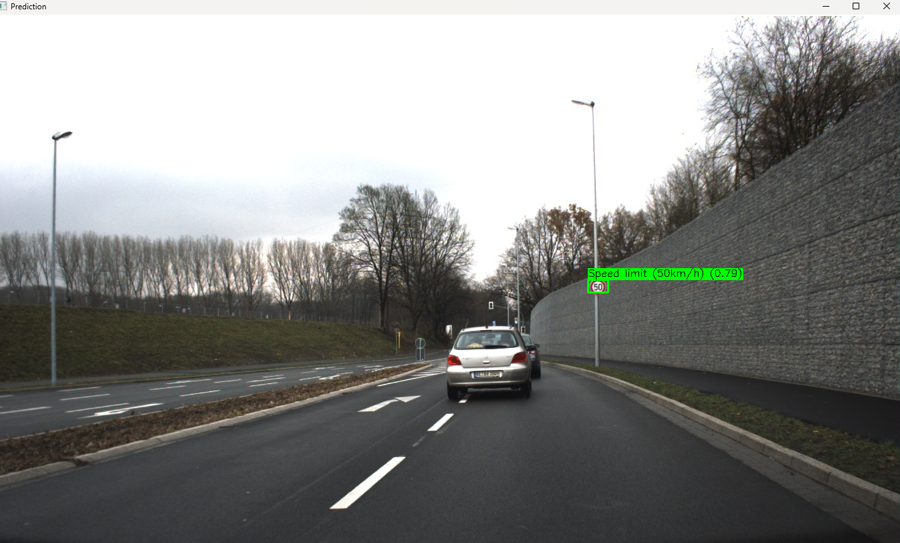

# Traffic Sign Detection and Recognition System

## Overview

The Traffic Sign Detection and Recognition System is a computer vision-based system
that utilizes OpenCV's object detection and classification capabilities to detect and
recognize traffic signs (e.g., stop signs, traffic lights) from images or videos. The system
aims to provide a reliable and efficient solution for autonomous vehicles, driver
assistance systems, and traffic surveillance applications.

## Features

* Traffic Sign Detection using ***YOLOv5***
* Traffic Sign Recognition using a traditional lightweight ***CNN***
* Supports image/video input
* Handles varying weather and lighting conditions

## Dependencies

* **Languages:**
    * Python (for model training and preprocessing)
    * C++ (for real-time inference and deployment)

* **Computer Vision:** OpenCV
* **Deep Learning Framework:**
    * PyTorch (used for training YOLO in Python)
    * ONNX (for model export)
    * OpenCV DNN Module (used for inference in C++)
* **Build System:** CMake

## Setup
1. **Download OpenCV**
    * Download the [OpenCV-MinGW-Build](https://github.com/huihut/OpenCV-MinGW-Build?tab=readme-ov-file) _OpenCV-4.5.5-x64_ version as a zip and extract it to your desired location.
    * Add the OpenCV-MinGW-Build `bin` path to your System Environment Varible.
2. **Clone Repository**
    * In your terminal, run  
     ``` git clone https://github.com/tamanna-04/Traffic-Sign-Detection-and-Recognition-System.git ```
    * Go to project directory with  
    ```cd Traffic-Sign-Detection-and-Recognition-System```

3. CMake Setup
    * Open ```setup_env_example.cmake``` and update the **OpenCV_DIR path**.
    * Rename the file to ```setup_env.cmake```
    * In your project root directory, run ```cmake --build build``` to make the build files


## Usage
Once the build files have been made successfully, open your command prompt and navigate to your project directory. Run ```cd build``` and use the following commands to run the project in its different modes to accept different input types: 
* ```main.exe --image <path-to-your-image>``` to run the project in image mode.
* ```main.exe --video <path-to-your-video>``` to run the project in video mode. 

## Output

*A traffic sign being detected and classified using the system.*

## Technical Documentation

For a deeper understanding of the system architecture, model design choices, code structure, and implementation details, please refer to the [Technical Documentation](./docs/) located in the `docs/` folder.


## Future Improvements

- Improve classification accuracy using larger training datasets
- Add support for real-time webcam input
- Optimize inference speed for embedded deployment


## License
This project is licensed under the MIT License. See the [License](./LICENSE) file for details. 

## Acknowledgments

This project was completed as part of the pre-onboarding process for **KPIT-Technologies**.  
Special thanks to the onboarding team for the opportunity to work on a practical, real-world problem.