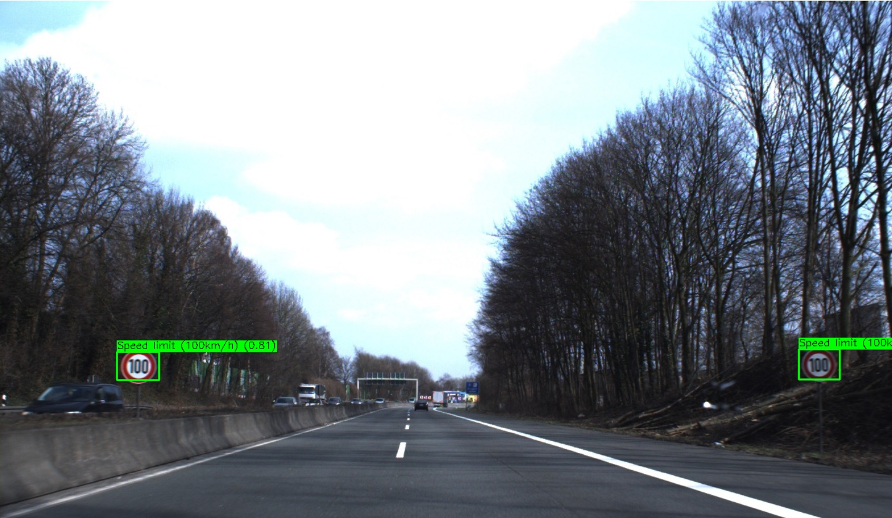

# Traffic-Sign-Detection-and-Recognition-System

A C++-based Traffic Sign Detection and Recognition (TSDR) system that leverages OpenCV for computer vision tasks. The system is capable of identifying and classifying traffic signs from both static images and video input. This project is designed to support intelligent transportation systems and driver-assistance applications.

## Features

- Detects and classifies common traffic signs from input images and videos.
- Utilizes OpenCV for image processing, contour detection, and feature extraction.
- Built with CMake for modularity and ease of compilation.
- Supports both real-time video streams and offline video/image inputs.

## Demo

### Image Input



## Technologies Used

- **C++**
- **OpenCV**
- **CMake**
- **Machine Learning** — pretrained classifiers & custom-trained models

## Getting Started

### Prerequisites

- C++17 or later
- OpenCV (version 4.x recommended)
- CMake (version 3.10 or above)

### Installation

1. **Clone the repository:**

   ```bash
   git clone https://github.com/yourusername/traffic-sign-detection.git
   cd traffic-sign-detection
   ```

2. Download the OpenCV from this link

[OpenCV-download-File Repository](https://github.com/Amul24/OpenCV-download-File.git)

3. Set the environment variables like this

```bash
OpenCV-MinGW-Build-OpenCV-4.5.5-x64\x64\mingw\bin
```

4. Generate build files using CMake

```bash
cmake -G "MinGW Makefiles" -S . -B build/
```

5. Build the project

```bash
cmake --build build/ --config Release
```

6. Run the executable

```bash
cd build
main.exe
Make sure main.exe exists after build. If it has a different name, replace accordingly.
```

### How It Works

- Preprocess input using color filtering and histogram equalization.

- Detect contours and identify potential regions of interest (ROIs).

- Extract features and classify them using trained models or rule-based logic.

- Annotate recognized traffic signs on the output frame.

### Limitations

- Currently supports only pre-recorded images and videos.

- Real-time detection using camera feed is not implemented.

- Accuracy may vary depending on lighting conditions and sign occlusions.

### Future Improvements

- Integrate real-time camera support.

- Improve classification accuracy using deep learning (e.g., CNN models).

- Add multilingual label support for international road signs.

### Contact

For queries or contributions, please contact amuljot0168.be21@chitkara.edu.in or raise an issue on GitHub.
