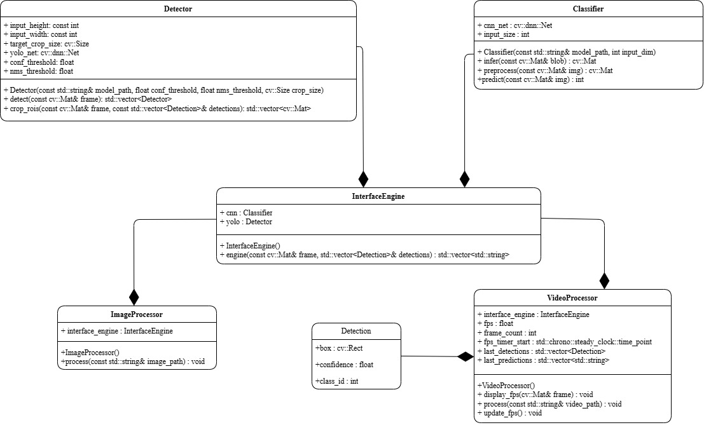

<!-- UML diagram -->
# UML Class Diagram
The UML Class DIagram provides a high-level overview of the project's structure, showcasing the main classes and their relationships. It reflects a modular, object-oriented design where each component has a well-defined responsibility.  

  

## Class Descriptions
``` Classifier```  
Handles image classification using a pre-trained CNN model.
#### Key Functions:
- ```infer()``` - performs inference
- ```preprocess()``` - resizes and prepares input image
- ```predict()``` - returns predicted class ID  
----
```Detector```  
Implements object detection using YOLO.
#### Key Functions:
- ```detect()``` - runs inference and returns detection results
- ```crop_rois()``` - extracts ROIs from the original frame for classification  
---
```Detection```  
A simple data class representing each detection.  
#### Fields:  
- ```box``` - bounding box coordinates
- ```confidence``` - detection confidence
- ```class_id``` - detected class label
---
```InterfaceEngine```  
Acts as a middle layer between detection and classification.  
#### Key Functions:  
- Initializes and calls both ```Detector``` and ```Classifier```
- Handles logic for end-to-end image inference  
---
```ImageProcessor```

Processes static images using ```InterfaceEngine```.  
#### Key Function: 
- ```process()``` - takes an image path, runs detection and classification  
---
```VideoProcessor```
Processes video input frame by frame.  
#### Key Functions:  
- ```process()``` - runs detection and classification per frame 
- ```display_fps()``` - overlays FPS on output video
- Maintains state for predictions and timing  

## Class Relationships  
- ### Aggregation  
    - ```InterfaceEngine``` aggregates ```Detector``` and ```Classifier```
    - ```ImageProcessor``` and ```VideoProcessor``` both depend on ```InterfaceEngine```
- ### Association
    - ```VideoProcessor``` holds recent ```Detection``` results and classification outputs for display  

## Design Notes  
- The architecture promotes separation of concerns – each class handles one responsibility.
- Easy to plug in new models by modifying only the ```Detector``` or ```Classifier```.
- The modular setup improves testability, code reuse, and clarity.
- Minimal dependencies across components improve maintainability and scalability.

